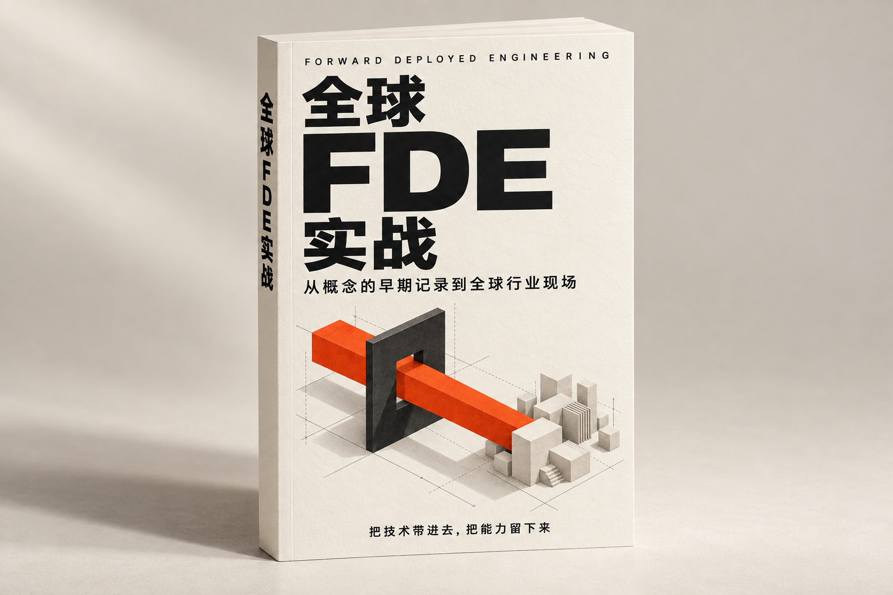

# 全球FDE实战

**从概念的早期记录到全球行业现场。把技术带进去，把能力留下来。**

**[开始阅读：序章](https://pafa.github.io/global-fde/chapters/C00.html)** · [在线阅读首页](https://pafa.github.io/global-fde/) · [按主题选读](appendix/reading-guide.md) · [提出问题与建议](https://github.com/pafa/global-fde/issues)

一个演示跑通以后，企业仍然要回答许多问题：接入的数据能不能信？谁有权改变流程？出了错由谁处理？工程师离开以后，客户还能不能继续使用？

FDE（Forward Deployed Engineer，前线部署工程师）走进的，正是技术能力与这些现实条件相遇的地方。理解这个岗位，需要同时看见工程师怎样工作、客户怎样做决定，以及一家企业为什么愿意为这种交付方式投入人力。

《全球FDE实战》是一本兼顾经营与技术的中文书。它从名称出现之前的客户工程讲起，追踪 FDE 的早期记录与 Palantir 的实践，再走向模型与 Agent 时代的项目、行业和地区。全书围绕一个问题展开：**怎样把一次现场交付，变成客户用得起来、团队交得出去、产品积累得下来的能力？**

## 你会在书里找到什么

- **一条有依据的历史线。** 区分工作方式的前史、名称的出现与组织模式的演变，理解 FDE 与售前、咨询、实施之间的联系和差异。
- **组织与经营的判断。** 什么项目值得派人进去，团队如何分工，成本和收入怎样计算，客户需求又怎样回到产品。
- **从第一周到离场的交付过程。** 需求发现、数据解释、生产运行、评估验收、采用与移交，各有需要作出的具体决定。
- **行业和国家带来的真实差别。** 从公共部门、医疗、金融，到制造、能源、物流、法律、零售、农业与教育研究，观察采购、责任、业务流程和本地能力怎样改变交付。
- **七章连续的成长路径。** 从能力诊断、业务与技术判断、现场协作，走到作品、岗位选择与长期成长，配合已有教学图、练习指南和合成数据形成可检查的成果。
- **8个重点国家的实践窗口。** 美国、英国、法国、德国、中国、日本、印度与新加坡各成一章，讨论企业、制度和具体工作；不把少数案例写成国家的统一性格。

- **实施公司的具体做法。** 以Palantir从现场工程到AI FDE的演进为首个重点公司案例，再比较Accenture、BCG、McKinsey、Capgemini、Deloitte、Infosys、TCS、Fujitsu及云平台的交付分工、代表案例与AI自动化，检查客户究竟得到什么、还要承担什么。

## 适合谁，怎样开始读

全书从问题和案例出发，再解释必要的技术概念。非技术读者可以先读经营与组织判断；需要动手的读者，可以继续进入章内练习和附件。

| 你最关心什么 | 建议从这里开始 |
| --- | --- |
| 企业负责人：是否需要 FDE，投入能否持续 | [甲方怎样选择](chapters/C33.md)或[乙方怎样经营](chapters/C34.md) → [双方权责](chapters/C35.md) → [团队配置](chapters/C25.md) → [项目经济性](chapters/C26.md) |
| 产品与技术负责人：怎样交付，又怎样积累产品能力 | [第一周的需求发现](chapters/C05.md) → [从演示到运行](chapters/C07.md) → [让产品成长](chapters/C27.md) |
| 准备进入 FDE 的实践者：需要哪些能力，如何练习 | [能力地图](chapters/C48.md) → [业务判断](chapters/C49.md) → [技术判断](chapters/C50.md) → [现场协作](chapters/C51.md) → [学习与作品](chapters/C29.md) |

想完整理解来龙去脉，可以从序章按目录顺序读下去。带着某个行业或项目问题而来，可以先查 [阅读索引与术语](appendix/reading-guide.md)，再回到相关章节。

## 关于资料与案例

当前为 **2026年10月修订版**，资料截止 **2026-10-08**，包含序章、54 个主题章节、结语和阅读索引。各章保留来源链接与关键日期，区分同期记录、当事人回忆、公司陈述、研究判断和教学示例；案例未公开的成本、效果与细节，保留其可知范围。

书中分别辨认明确自称 FDE 的实践、可证明的相似交付方式与相关 AI 应用，并把宣布、试点、上线和经营结果分开讨论。欢迎补充新材料、指出错漏或提出不同解释，让这本书持续修订。

## 目录

章节从第1章到第54章按阅读顺序连续编号。七篇依次回答：FDE是什么、要不要组建团队、怎样交付、行业怎样改变工作、不同国家有什么条件，如何成为优秀的FDE，以及怎样选择实施公司、使用AI参与交付。也可以直接选择与自己有关的行业或国家。

逐项新增与历史内容处理方式见[阅读索引](appendix/reading-guide.md)。

- [序章　技术到门口以后](chapters/C00.md)

### 第1篇　理解FDE：概念、边界与演变

- [第1章　名称出现之前，问题已经在那里](chapters/C01.md)
- [第2章　FDE与售前、咨询、实施：怎样辨认责任边界](chapters/C32.md)
- [第3章　Palantir：现场的问题，怎样进入产品](chapters/C02.md)
- [第4章　平台、伙伴与客户：商业交付怎样接起来](chapters/C03.md)
- [第5章　模型更强以后，工程工作移到了哪里](chapters/C04.md)
- [第6章　当Agent也能写代码，FDE会怎样变化](chapters/C30.md)

### 第2篇　组织FDE：甲乙双方的投入与经营

- [第7章　甲方：什么时候值得引入 FDE](chapters/C33.md)
- [第8章　乙方：什么时候值得经营 FDE 业务](chapters/C34.md)
- [第9章　甲乙双方：谁决定目标、权限与结果](chapters/C35.md)
- [第10章　团队怎样配置、招聘与考核](chapters/C25.md)
- [第11章　合同与价格：为确定交付，也为探索留边界](chapters/C36.md)
- [第12章　项目经济性：把双方的账算清楚](chapters/C26.md)
- [第13章　项目组合：何时增员，何时拒绝下一个客户](chapters/C37.md)

### 第3篇　交付FDE：从第一个问题到持续运行

- [第14章　第一周，先弄清楚谁真正需要什么](chapters/C05.md)
- [第15章　数据进入系统之前，先进入同一种语言](chapters/C06.md)
- [第16章　从能演示到能运行](chapters/C07.md)
- [第17章　上线前的最后几道门](chapters/C08.md)
- [第18章　交付之后：真正的使用与离场](chapters/C09.md)
- [第19章　每个客户都不同，产品怎样成长](chapters/C27.md)
- [第20章　工作条件不同，交付怎样调整](chapters/C24.md)
- [第21章　边界、风险与退出](chapters/C28.md)

### 第4篇　走进行业：不同业务的交付难题

- [第22章　公共部门与国防：任务、采购和问责](chapters/C10.md)
- [第23章　医疗：让流程改善经得起追问](chapters/C11.md)
- [第24章　金融与保险：可用之外，还要可追责](chapters/C12.md)
- [第25章　法律与专业服务：交付的是哪一种信任](chapters/C17.md)
- [第26章　制造与航空：工程师必须理解生产](chapters/C13.md)
- [第27章　能源与矿业：干预之后，怎样读懂结果](chapters/C14.md)
- [第28章　物流与运输：局部更快，整体更好吗](chapters/C15.md)
- [第29章　电信：巨型网络里的小范围落地](chapters/C18.md)
- [第30章　农业：让建议赶得上农时](chapters/C19.md)
- [第31章　零售与消费：体验要落在真实交易里](chapters/C16.md)
- [第32章　教会学生，还是推进研究：两种不同的共建](chapters/C20.md)

### 第5篇　走进国家：企业、制度与工作方式

- [第33章　美国：平台企业与客户怎样分担交付](chapters/C21.md)
- [第34章　英国：公共问责怎样进入共同开发](chapters/C38.md)
- [第35章　法国：本地模型与业务机构怎样共建](chapters/C39.md)
- [第36章　德国：工业知识与共同决策怎样进入系统](chapters/C40.md)
- [第37章　中国：采购承诺怎样变成共同工程](chapters/C22.md)
- [第38章　日本：本地伙伴怎样把自用经验变成交付能力](chapters/C23.md)
- [第39章　印度：让语言知识与行业交付进入同一项工作](chapters/C42.md)
- [第40章　新加坡：客户已有产品团队时，外部工程补在哪里](chapters/C43.md)

### 第6篇　成为FDE：从能力准备到长期成长

- [第41章　能力地图：从会做任务到能承担结果](chapters/C48.md)
- [第42章　业务判断：先弄懂工作，再解释方案](chapters/C49.md)
- [第43章　技术判断：面对未知怎样推进](chapters/C50.md)
- [第44章　现场协作：让不同角色愿意一起工作](chapters/C51.md)
- [第45章　学习与作品：用可检查的成果证明能力](chapters/C29.md)
- [第46章　选择岗位：从准备面试到判断双向匹配](chapters/C52.md)
- [第47章　长期成长：从亲手完成到培养他人](chapters/C53.md)

### 第7篇　选择实施方：全球公司与AI交付机制

- [第48章　实施方怎么选：先分清谁能改变什么](chapters/C54.md)
- [第49章　Palantir：从现场工程到AI FDE](chapters/C60.md)
- [第50章　Accenture与模型厂商：把工程、业务变化和评估接起来](chapters/C55.md)
- [第51章　BCG与McKinsey：把业务改造写进系统](chapters/C56.md)
- [第52章　Capgemini与Deloitte：让集成和专业判断各有位置](chapters/C57.md)
- [第53章　Infosys、TCS与Fujitsu：规模交付怎样保留现场知识](chapters/C58.md)
- [第54章　AI怎样参与FDE交付：自动化工作，保留决定](chapters/C59.md)
- [结语　把能力留在问题发生的地方](chapters/C31.md)

### 附录

- [阅读索引：先作哪项判断，再去哪里找证据](appendix/reading-guide.md)
- 教学图、练习指南与合成数据随对应章节链接提供；它们属于书的实战内容。

## 参与这本书

发现事实、日期、译名、引用或表达问题，可以从阅读页的“反馈本页”提出 [Issue](https://github.com/pafa/global-fde/issues)。如果方便，请附上具体位置、原文、修改建议和依据。不同观点同样欢迎。

也可以 [Fork 这本书](https://github.com/pafa/global-fde/fork)，修改相应 Markdown 章节后提交 Pull Request。新增事实请附可靠来源，并保留事件日期与材料发布日期的区别。提交修订表示你有权提供相关内容，并愿意按本书相同许可分享。

## 许可与署名

© 2026 PAFA 与本书贡献者。原创书稿、教学图和教学附件采用 [CC BY-SA 4.0](https://creativecommons.org/licenses/by-sa/4.0/deed.zh-hans)：允许分享、改编和商业使用，须适当署名、提供许可链接、注明修改，并以相同许可分享改编作品。完整条款见 [LICENSE](LICENSE)。书中引述的第三方材料及商标仍归原权利人，不因收录而改变其许可。

推荐署名：PAFA 与贡献者，《全球FDE实战》，2026年10月修订版，https://github.com/pafa/global-fde ，CC BY-SA 4.0；改编时另注明修改。
