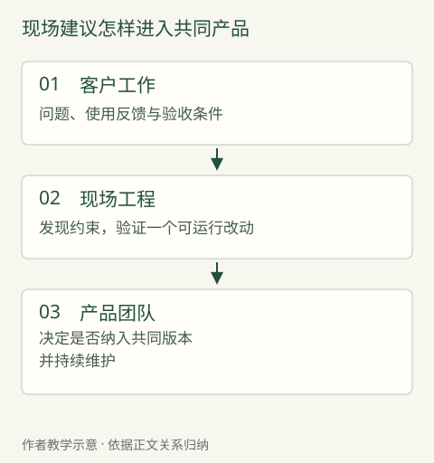

# Palantir：现场的问题，怎样进入产品

软件在测试环境里表现正常，到了银行，却被一项空白数据拖垮了。

前 Palantir 工程师 Vinoo Ganesh 在 2026 年 9 月的回忆中说，他在 2013 年参与开发交易数据存储系统 Phoenix。后来一次银行部署遇到缺失的时间字段，程序把它当成 1970 年的起点，申请大量时间分段，最终耗尽内存。银行没有具名，故障日期也未披露。后来他到客户环境修正问题，直接面对使用 Phoenix 的前线工程师；这些人又把它用于原先未列入范围的业务，推动产品团队重新考虑平台能力。[^1]

这不是一个“工程师到了现场，所以软件就好了”的故事。异常输入测试本来就应该做好；如果代表真实工作的数据能更早进入测试，一部分故障可能在办公室里被发现。真正值得追问的是：谁负责把遗漏的事实带进来，又有谁能让它改变下一次交付？

Palantir 的组织安排试图同时承担两种结果：让一个客户的工作走通，让同一套产品以后能服务更多客户。两者有时相互促进，有时直接冲突。本章沿着这种冲突看三类材料：明确的岗位分工、具名工程人员提出产品异议的回忆，以及一个共享能力的形成过程。它们来自不同项目，不拼成一次客户交付。

## 一个客户的结果，和一个产品的责任

2019 年 4 月，Palantir 在公开说明中将核心软件工程师称为 Dev，归入产品开发；将前线部署软件工程师称为 Delta，归入业务拓展。Dev 面向多位客户建设一项能力，Delta 则组织多项能力完成一个客户的技术目标。公司同时允许前线团队向核心产品贡献代码，较大需求仍须与路线图协调并接受产品团队审阅。[^2]

“业务拓展”容易让人联想到销售，但这份材料描述的责任包含实际建设。反过来，能够写代码也不意味着前线团队可以随意改变公共产品。客户今天需要恢复工作，平台明天仍要对其他客户负责，不能只用同一张任务清单管理。

假如一项功能本身符合规格，几项功能组合起来却不能完成客户的工作，谁来处理这个空档？如果一名工程师为眼前客户做了特殊修改，谁来判断它是否值得进入公共版本？Dev 与 Delta 的区别，正在这两个问题之间。

2020 年的一份公司访谈让这种责任更具体。前线工程师 Brian 因疫情远程服务一位美国国防部客户，在 Gotham 平台上建设工作流，并承担生产故障定位、修复部署、稳定性观察和客户协调。这里的“工作流”，就是软件帮助人完成一件事的实际步骤。[^3] 远程并不妨碍他承担运行结果；办公地点不能单独定义前线。

2022 年公司又介绍了 Deployment Strategist，内部称 Echo：这个角色侧重理解业务、选择问题与推进应用，职责与 Delta 有交叉。[^4] 因而本章讨论的从来不是一位万能工程师，而是三种注意力怎样配合：客户究竟要完成什么、系统怎样实现、哪些部分值得长期成为产品。

这里存在一个容易被部门图遮住的困难。现场最先看见新问题，不一定最有权改变产品；核心团队最有权改变产品，也不一定最先感到问题的后果。组织需要让证据穿过这道距离，而不是只增加需求传递的层数。

*图：现场建议怎样进入共同产品。双向沟通不等于建议自动被采纳；Nexus与Compute Modules的真实记录见C02。*

## 当产品团队不接受现场的判断

2024 年，Palantir 技术负责人 Shyam Sankar 回忆了一次这样的争议。质量工程师 Mark Scianna 长期接触网络受限的使用环境，提出重设计 Nexus Peering。这个名称指跨系统共享、同步数据的一项能力；公司的公开产品说明写到，断连时可把数据排队，等待连接恢复后传送。[^5] 这解释了网络条件为什么会成为产品问题，但不能据后来的说明复原当年的全部设计。建议起初没有获得工程团队支持，他与几位同事随后做出原型。Sankar 称，原型的后继仍支撑公司运行。原文没有给出重设计的准确年份、完整验收或客户结果，也没有将 Mark 当时的职位写成 FDE。[^6]

这个片段的价值，不在于证明“越过流程总是正确”，而在于让反馈有了具体形状。争议不是客户提了一项功能、总部照单排期；它是现场使用者的处境与既有产品判断发生了冲突。原型使讨论多了一个可以检查的对象。

我们仍然不能由一位高管的成功回忆得出所有类似主张都应被接受。没有被采纳的建议可能同样很多，原型也可能牺牲了维护性。材料没有提供这些对照。能够保留的较窄认识是：当团队怀疑现有产品无法满足真实使用条件时，只把意见放进需求池，未必足以改变判断；还需要一种验证新方案的办法。

对管理者而言，关键选择不是偏爱总部还是现场，而是愿意拿什么证据改变决定。现场团队必须说明障碍发生在哪里、什么条件下出现、现有方案为何不能处理；产品团队则要说明担心的兼容性、维护或资源问题。一个小原型可以帮助双方区分“确实做不到”和“尚未验证值得做”。这部分是由案例得到的分析，不是对当年会议或决策程序的复原。

Phoenix 和 Nexus Peering 留给我们的信息不同。前者说明被间接转述的客户工作可能漏掉关键输入；后者说明即使信息已经传回去，组织也未必愿意据此改变产品。靠近客户解决了发现问题的机会，没有自动解决选择问题的权力。

## 把定制服务变成客户可以使用的能力

如果提议终于被接受，产品化也还没有结束。让原项目能运行，与让下一位使用者能独立使用，是两道不同的门。

Palantir 开发者在 2025 年 3 月回顾 Compute Modules（计算模块）的形成：卫星图像处理的负载忽高忽低，需要自动增减计算资源。团队在 2022 年做过定制服务，却难以让用户自行运行，于是将既有能力扩展为通用容器接口。容器可以粗略理解为把程序与所需运行环境装在一起的包。文章列出后续的客户模型和 Cohere 模型用途；发表时，该能力在云环境中仍标为 Beta，即测试阶段。[^7]

这里最有解释力的变化，是使用权与操作能力的变化。第一种安排下，客户要依赖供应商运行一项特殊服务；第二种安排试图让用户把自己的程序带进平台。这不是把某段代码复制给更多人，而是重新设计用户能够控制什么、平台仍替他保证什么。

自由越大，接口上的责任越多。一套只由原团队操作的程序，可以靠熟悉代码的人发现输入不合适；一个公共能力却必须让陌生使用者知道怎样接入、怎样发现错误、怎样选择运行资源。原来通过共同工作解决的问题，有一部分需要变成产品本身能表达的条件。否则所谓开放，只是把排障劳动交给了客户。

这条公开记录比“现场反馈促进产品创新”多走了一步：它指出原安排的限制，说明改变的方向，也给出后续用途。但它没有公开每次发布的日期、客户维护投入，或具体成员的 FDE 职衔。因此，它是共享产品如何形成的机制证据，不能用于计算 FDE 创造了多少收入，更不能当成 Phoenix 的后续产品史。

可以把三段材料放进同一幅判断图里，但保留各自的身份：Phoenix 告诉我们怎样发现假设失真；Nexus Peering 告诉我们反馈可能遭遇拒绝；Compute Modules 告诉我们通过验证的办法还要改变使用方式。没有任何一段单独证明了从第一次现场发现到所有客户受益的完整闭环。

## 让发布变快，也可能制造新的距离

共同产品越多，就越需要处理各客户环境的不同条件。

Palantir 在 2021 年年报中称，Apollo 起初用于向客户环境持续交付自家软件，2021 年开始作为商业方案对外提供。2022 年的公开演示解释，升级和必要时的回退需要遵守预先定义的条件。[^8][^9] 用普通语言说，新版本不能只管送到；它可能依赖另一项功能先更新，也可能碰到客户此刻不能改变的运行条件。

这看起来像把工程师反复确认的事情交给产品，但自动化还有另一面。Sankar 在 2024 年回忆，Apollo 使团队能够独立发布之后，整体使用体验的协调反而变难，公司又调整了前端代码组织和产品责任。[^6]

一次产品化消除了旧等待，也可能产生新接缝。各团队更容易把自己的组件交出去，不表示客户更容易把组件共同用起来。若仍只考核每支团队发布得快不快，客户结果便可能再次落到无人负责的地方。

所以，公共产品与现场工程不是此消彼长的简单关系。产品承担重复工作，前线才有机会处理新的难题；但产品之间的新组合，又可能需要现场验证。值得追踪的是同一种问题是否减少、剩余问题是否改变，而不只是前线人数上升或下降。

## 工程投入先发生，回报随后才可能发生

这种组织方式有一笔不能省略的账。

Palantir 2020 年上市文件将客户分为 Acquire、Expand、Scale，分别对应争取、扩展与规模化。2019 年末归入 Acquire 的那组客户，当年收入为 60 万美元，贡献亏损为 6540 万美元。贡献亏损是公司规定口径下收入减去交付及销售营销相关费用后的差额，不包括股权报酬，也不是净亏损。[^10]

这组账户数据说明工程与销售投入可以远早于回报，不能当成一位 FDE 或一个项目的成本。Scale 类别本身又要求一定收入和正贡献，不能用这组账户表现反推所有早期投入最终都会成功。

经营者需要分别判断两件事：当前客户的工作是否值得继续投入，当前投入是否留下了下一次可用的能力。它们可以同时成立，也可以只成立一件。一个客户得到很好的服务，供应商却没有积累公共能力，可能仍是一项合理生意，只是需要按服务投入管理；一项有潜力的平台改进，眼前客户却迟迟不能使用，也不能只拿未来价值安慰对方。

平台成熟、客户范围扩展、定价与客户选择都可能改变这笔账。公开资料不足以把公司财务变化单独归因于 FDE。组织和项目经济性在经营篇继续展开；这里需要记住的是，现场见识不是免费的，而产品回流也不是仅凭热情就会发生。

## 下一次产品会议，可以怎样作决定

下面是一项依据本章机制构造的短练习，不是上述公司的实际决策记录。

一个客户需要运行自己的模型。前线团队已经用特殊脚本把它接进来，但每次更新都需要原工程师处理。产品团队需要决定：继续作为付费定制服务，还是建设一个通用接入能力？

| 已经知道或仍需知道 | 示范判断 | 会改变判断的条件 |
| --- | --- | --- |
| 客户当前确有工作被阻碍；临时办法能够恢复使用 | 先明确临时办法的负责人和支持范围，保障现有工作 | 临时方案无法满足客户权限或运行要求，就不能继续扩大使用 |
| 只有这一家提出同类要求，接口还经常变化 | 可以暂留客户侧，约定下一次复查，不立即承诺公共产品 | 其他客户出现相似输入与控制需求，才有更强复用理由 |
| 多家客户需要相同接入方式，但运行条件不同 | 试做共同接口，以另一种客户条件检验 | 若每次仍须改底层代码，就应重新划分公共部分 |

这份答案不要求每项需求都进入产品。它要求每次选择都有清楚的去处：客户侧服务、公共能力，或停止投入。另一种合理选择是客户自己建设接口，供应商提供稳定的平台支持；只要能力和持续成本确实存在，就不必为了 FDE 模式而强行共同开发。

回到银行里的空白时间字段。一次错误可以由一次补丁结束，也可以促成更真实的测试、更好的接口或新的产品判断。区别不在于是否给排障人员一个响亮职称，而在于组织是否让看见问题的人能够提出改变，让公共产品的负责人有证据作取舍，并愿意检验下一个客户是否真的少走了一步。

[^1]: Vinoo Ganesh，2026-09-12，[The Rise of the Forward Deployed Engineer — and How To Do the Job Right](https://www.latent.space/p/forward-deployed-engineer-best-practices)，The history of Project Frontline 小节；亦核对[作者本人版本](https://vinoo.io/writing/2026-09-12-the-rise-of-the-forward-deployed-engineer/)。同一文章，不计为两份独立证据。2013 年指参与开发；故障和用途扩展的日期、随后发布的具体功能未列明。
[^2]: Palantir，2019-04-08，[Dev versus Delta](https://blog.palantir.com/dev-versus-delta-demystifying-engineering-roles-at-palantir-ad44c2a6e87)，Wait, what’s a Delta? 小节，组织归属、责任范围及代码回流段。该时点的公司组织说明。
[^3]: Palantir，2020-11-02，[A Day in the Life of a Palantir Forward Deployed Software Engineer](https://blog.palantir.com/a-day-in-the-life-of-a-palantir-forward-deployed-software-engineer-45ef2de257b1)，Brian 访谈的日常工作及技术挑战两节。
[^4]: Palantir，2022-03-08，[A Day in the Life of a Palantir Deployment Strategist](https://blog.palantir.com/a-day-in-the-life-of-a-palantir-deployment-strategist-951cb59a5a96)，开篇角色关系、Daily Life as a Pilot Lead。工作日是说明性示例，不作具名项目实录。
[^8]: Palantir，[2021 Form 10-K](https://www.sec.gov/Archives/edgar/data/1321655/000119312522050913/d273589d10k.htm)，2022-02-24 提交，Our Platforms / Apollo，第 6 页。对外商业提供年份为 2021 年。
[^9]: Palantir，2022-04-27，[Apollo Demo Day 英文实录](https://investors.palantir.com/files/Apollo%20Demo%20Day%20-%20Transcript%20EN.pdf)，第 3—4 页，交付条件与回退机制。采用机制解释，不把演示当客户效果验证。
[^10]: Palantir，2020-08-25，[Form S-1](https://www.sec.gov/Archives/edgar/data/1321655/000119312520230013/d904406ds1.htm)，印刷页 88—91 的指标定义、账户分类及 Acquire 数据。数字是整组账户口径，不能当作一个项目成本。
[^7]: Palantir Developer Community，2025-03-25，[Why we built it: Compute Modules](https://community.palantir.com/t/why-we-built-it-compute-modules/3292)，正文第10—25、43行；访问日期：2026-09-26。供应商回顾；未确认具体FDE职衔或客户独立结果。
[^6]: Shyam Sankar，[The Primacy of Winning：官方公开全文](https://go.piratewires.com/ti/winning-full-length)，页面日期2024-04-09，Real Growth Will Never Not Be Painful与Kill the Orcs两节；访问日期：2026-09-26。同期短页面标2024-04-08，属同一篇文章；采用当事人回忆，不采用其成功因果与长工时规范性主张。

[^5]: Palantir，[Secure Collaboration](https://www.palantir.com/assets/xrfr7uokpv1b/4JWbqPQ8d6vYcNijOVqD0D/2857507783a328b6ddb6aef1ffc5fac4/Palantir_for_Secure_Collaboration__1_.pdf)，PDF第4页低带宽/断连和跨系统共享两段；版权页2022，发布日期未知，2026-09-26读取。只解释产品用途，不倒推重设计年月或客户成效。
