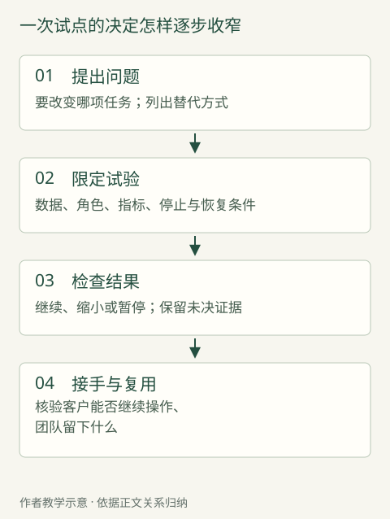

# 第一周，先弄清楚谁真正需要什么

客户买了平台，工程师到了现场，大家却没有对要搬进去的工作达成一致。

2026年8月5日，工程协作软件公司Koddex发布了一篇FDE访谈。受访者Valentin Houssin讲述一个仍在推进的匿名工业客户项目：各团队对共享流程存在分歧，一度使集成与建模无法前进。有员工认为，IT只是把新工具交给自己。团队于是拿真实数据演示，逐项讨论需求和原做法的理由。为了替换旧看板工具，他们还加快仪表板安排，增加协作通知功能。[^1]

这份供应商记录没有给出完整迁移结果，却留下了路线改变的证据：起点并非把旧表照搬到新平台；用户是否理解、是否愿意迁移，反过来改变了产品要先补什么。FDE的工作在这里同时指向两边——请客户明确流程，也让产品团队回应交付中暴露的缺口。客户尚未对齐的地方，工程师无法仅靠更快写代码替其作决定。

第一周的价值，正在于把这种含混变成可以行动的选择。这里的“第一周”是项目起步的视角，不是七天完成调研的承诺。有些任务已经十分清楚，半天就能开始试做；有些涉及多个组织，第一周能确定下一步该找谁、缺什么证据，已经是实质进展。

## 先把愿望放回一项工作

客户说需要智能客服，可能希望减少重复咨询；也可能希望更早发现订单异常，避免用户不得不打电话。两者都可能降低咨询量，工程起点却完全不同。前者改回答，后者改事情发生的过程。若没有区分，FDE 很可能认真优化一段本来可以不发生的对话。

英国政府数字服务的发现阶段指南，要求团队审视别人已经指定的解决方案，把它重新表述为待解决的问题，并考虑改进内容或流程等替代办法。[^2] 这不是每家企业都要照搬的阶段制度，但它提供了一项有用的纪律：在选工具之前，先说清楚，谁原来怎样做事，哪一步为什么值得改变。

把问题表述得具体，未必需要复杂的框架。不妨看一个贯穿本章的教学情境：一家提供设备维修服务的企业，希望用 AI 加快受理。以下人员、动作和试验安排均为本书构造，用来说明选择，不是某个真实客户的项目记录。

在这个情境里，用户提交故障描述，受理人员判断需要补充什么，再安排维修。主管希望少积压，受理人员希望少来回追问，维修人员希望接到的任务信息够用，用户则希望知道什么时候能解决。大家都会赞同“提高效率”，但各自心里的终点不同。系统把任务更快转给维修人员，主管看到积压下降；如果故障型号仍然不清楚，追问只是换了一个部门发生。

因此，第一份值得画的图很朴素：请求从哪里进来，经过谁，何时停下，靠什么信息继续，最后怎样确认结束。每一步尽量使用动词：补照片、核型号、约时间、确认到场。这样的图能让抽象愿望露出接口。所谓接口，在这里首先是工作交给另一个人时必须带走什么，而不是程序里的一串地址。

图也不宜画得过满。如果首次合作的目标只是改善受理信息，没必要把仓库、财务和所有售后制度一次画完。但与受理结果直接相连的下一步不能被裁掉。若维修人员无法使用新生成的摘要，受理页面做得再顺，项目仍没有完成原来的工作。

这一轮讨论应产生一个比“建设智能维修平台”更小的候选：让受理人员在安排维修之前，更容易识别尚缺的设备信息，并向用户提出必要的补充请求。它还不是最后的需求，却已经能接受检查。团队可以拿真实的历史任务来问，缺信息是否常见，它究竟拖慢了哪一步，有没有更简单的办法。

## 看见做法，也要弄懂理由

有了候选工作，接下来不急着讨论功能。先看它今天怎样完成。

访谈擅长了解一个人认为重要的事情；实际操作记录则可能显示，他花时间的地方与自己概括的重点并不相同。对此不必预设任何一方不诚实。一个熟练员工可能已经习惯了每天补一个字段，不再把它当成问题；主管更可能看见月报里的平均时间，而看不见其中一次反复转交。

在维修教学情境中，FDE 可以请受理人员解释一项已经结束的普通任务，再看一项曾经卡住的任务。普通任务帮助建立正常路径，异常任务暴露路径成立所需的条件。只看异常，容易误以为每件事都需要复杂判断；只看顺利完成的任务，又容易把熟练人员临时补上的工作当作系统本来就会做。

观察时要把所见与解释分开记录。例如，“员工先打开另一张表再继续填写”是可观察动作；“因为系统不好用”只是一个待核的解释。另一张表可能保存了必要的业务规则，也可能只是个人习惯。先问那张表帮助判断什么，再决定应该增加功能、同步信息，还是保留这个本来有效的做法。

政府数字服务的观察指南，明确讨论了沉默观察与中途提问的取舍：前者较接近日常行为，却可能看不懂原因；后者有助理解，也会打断工作。[^3] 这提醒 FDE，贴近现场不会自动生成真相。观察者本身也会改变现场，需要适时追问，并让被观察者纠正自己的理解。

还要看没有出现在演示中的人。若只邀请最熟练、最支持项目的员工，团队容易得到一个条件优越的样本。新入职员工会不会做，忙碌时是否仍有空检查，偶尔处理此项工作的人能否理解提示，都可能改变方案。但不需要为了“全面”无限扩大访谈名单：新增一种对象，应当对应一个可能改变决定的差异。

怎样知道已经了解得够多？可以做一个小检验：让工程师用自己的话复述一项具体任务，指出它可能在哪里停下，以及停下后谁能解释。再请业务人员纠正。若双方连“完成”指的是什么都不一致，继续做界面只会把分歧暂时藏起来；若主要路径已经一致，剩下的是某个技术条件能否满足，就可以转入试做。

## 谁提出问题，谁能改变它

需求不是只从一位“客户代表”那里收集来的。

出资者决定这件事值不值得做，使用者知道每天怎样做，业务负责人能够改变工作安排，技术或数据负责人则知道系统允许什么。同一个人可以兼任数种角色，但角色不会因此消失。缺少其中一种声音，项目可能在后面以返工的形式重新遇到它。

继续看维修情境。主管要求减少受理时长，工程师据此生成更短的提问；一线人员却坚持保留几个确认步骤。如果把这种意见简单理解为抗拒变化，就可能删掉维修人员真正依赖的信息。反过来，一线偏好的每一个字段也不必永久保留：有些只是旧表单延续下来的习惯。FDE 需要把争论带回具体任务，确认保留与删除各会造成什么后果。

这与让所有人投票不同。使用者能指出检查被删后哪里难以工作，却未必有权改变公司承诺；出资者能够调整目标，却未必知道数据字段在现场的含义。讨论可以广泛，决定权必须具体。否则，每次有人提出新意见，团队都只能把范围继续加大。

一个可用的起步安排，是给每项尚未解决的问题找一个能够回答它的人，而不是先给每个人一个漂亮头衔。例如，哪些设备型号必须确认，由熟悉维修条件的人解释；什么情况下可以直接预约，由有业务授权的人决定；现有系统能否读取已核实的型号，由系统负责人验证。工程师负责把答案变成可以检查的行为。

这也能揭示某些项目为什么暂时不适合推进。大家都认为问题重要，却没有人能调出必要记录，也没有人能安排实际使用者参与，FDE 便只能依靠二手叙述做出假设。与其把这种条件不足解释为工程师行动不够快，不如明确当前能验证的范围：可以验证技术可行性，但还不能承诺工作会因此改变。

需要警惕相反的过度要求。一个只改善内部文本整理的小工具，未必需要组织中所有部门签字。参与范围应随改变的后果扩大。若只是帮助员工看得更快，先由实际使用者试用并纠错可能足够；若系统将自动向客户承诺到场时间，就必须让能够履行承诺的人参与。范围与责任在这里是一件事的两面。

## 快一点，究竟是哪一种快

即使客户已经很懂技术，需求也不会自动清楚。

Baseten 对 Writer 的合作记录，明确提到模型性能工程师和 FDE 参与。Writer 已有自己的语言模型，需要解决面向真实请求的运行问题。双方讨论等待时间、同时处理请求的能力和成本，再针对模型及实际请求形态构建专用推理引擎；这里的引擎，就是把已训练模型安排到计算设备上高效运行的软件。[^4] 需求影响的不只是性能目标，也影响怎样组织计算工作。

这段材料的启发在于，“更快”并不是一个已经完成定义的技术要求。用户等待第一句话，和企业等待一批文档全部处理完，是两种不同的工作。前者可能更在意立即得到回应；后者可能接受单份文档稍慢，只要整批工作在规定时间内完成。购买同一种计算资源，也可能需要不同的安排。

FDE 的需求工作，由此进入工程判断。若不清楚客户面对的是哪一种等待，团队即使得到一个漂亮的性能数字，也难以说明它改善了谁的工作。需要先把时间放回事件之间：从用户提交到开始响应，从资料齐全到完成处理，还是从提出需求到业务真正结束。比较对象一旦不同，“提速”就会产生不同含义。

维修情境也有同样的问题。一次受理看起来用了很久，可能大部分时间是在等用户补照片。缩短员工阅读描述的时间，未必显著减少用户等待；让补充要求一次讲清楚，反而可能更有效。但这只是一项待检验的解释，不能在没有记录时直接宣布它是瓶颈。

因此，需要保存现状，而不只收集对现状的不满。最少可以从若干任务中辨认：开始和结束用什么事件确定，中途停顿因为什么，返工怎样出现，最后结果有没有被接受。若只有一个总时长，工程师很难区分改善发生在哪一步，也难以判断是否把工作转移给了别人。

现状也不是一条永远不变的直线。忙季、人员熟练程度、请求复杂度都会影响结果。一次试用恰好遇到较容易的任务，不能据此认为系统产生了全部改善。起步阶段无需立即完成严密的长期试验，但至少应把比较任务的类型和条件写明，使后续结果有机会被合理解释。

这种谨慎有实际代价。记录会占用员工时间，历史系统也未必保存了想要的细节。解决办法是围绕决定取数：如果眼下只需判断信息缺失是否值得做，就先检查它出现在哪里、是否妨碍安排；不必为了将来可能需要的所有指标，先建设一整套统计平台。这份留作改进前后比较的现状记录，就是基线。它应当帮助选择下一步，而不是只让计划看起来更完整。

还需要把可见的节省和可能新增的劳动放在一起。假设模型替受理人员整理了描述，员工却要花更久逐句核对，那只是改变了劳动形式。反过来，首次试用时核对较慢，也不必立刻否定它：陌生界面可能有学习成本。较诚实的起步判断，是分别记下整理、检查和再次联系用户这几个动作，再观察哪些成本会随熟悉程度变化，哪些是每次都绕不开的工作。

价值也可能落在原来没有计时的地方。如果一段更完整的任务记录帮助维修人员少做一次无效上门，收益可能发生在受理部门之外。这不授权团队凭空估算节省金额，却要求讨论对象跟着结果走。只让受理主管判断方案，很可能遗漏关键后果；反之，把所有潜在收益都提前计入商业承诺，也会使一个尚未验证的想法显得过分确定。

## 用最小的动作检验最危险的假设

弄清工作以后，才有理由比较从哪里切入。

仍以维修为例，候选办法可能有三种：修改表单，让用户先填写必要信息；让 AI 从自由描述中提取信息，由员工确认；让 AI 直接与用户交谈并安排维修。它们覆盖的工作越来越多，需要承担的未知也越来越多。前一种可能难以适应复杂描述，后一种则同时依赖信息理解、工作规则、预约能力和用户信任。

继续这个教学情境。团队回看一项被搁置的任务：用户已说清设备出现什么故障，却没有提供型号。受理人员发出“请补充设备信息”的消息，用户随后上传的照片只拍到了品牌标志，任务仍不能安排。维修人员解释，选择备件需要铭牌上的具体型号；FDE 与系统负责人核对后确认，现有客户档案也没有这项信息。

这条记录改变了最初的猜测：至少在这个任务里，障碍不是员工读不懂描述，而是用户不知道该提供什么。AI 提取不能从现有文字中找出根本没出现的型号。业务负责人因此决定先缩到型号标识位于外壳的一类设备，改表单说明，用示意图告诉用户在哪里找型号，并保留“找不到”的人工接续入口。工程师先实现这个小改动，暂缓自动对话和预约。

一项任务不能证明这类问题普遍存在。下一步受控试用要看，修改后的说明能否让用户提交维修人员可用的信息，是否反而增加填表放弃，以及找不到型号的人能否得到接续。若说明已足够，团队就没有理由急着扩建聊天功能；若用户仍难以辨认，再比较图片辅助或人工指导。观察、解释和路线选择由此连在一起，也保留了推翻当前选择的机会。

一个相邻方法案例是英国司法部2018年6—9月的信息服务试验，服务对象为分居父母，使用预设脚本，参与者并非已证实的FDE。首轮用户发现可走的信息路径有限，团队后来增加内容和输入空间。评估也把开始互动、继续使用、转往支持服务和是否获得帮助分开。[^5] 这些区别提醒我们：用户愿意开始聊天，不足以证明预设路径能容纳他们真正要问的事。

试做也必须允许出现“不做”的答案。假如简单表单已经使受理更顺畅，继续增加自动对话需要新的理由。它可能仍然帮助那些无法按照表单表达问题的用户，但那是一个更具体的对象和承诺。把结果拆开，团队就不必在“全面上 AI”和“AI 没有价值”之间来回摆动。

相反，有些情形值得较早写代码。例如关键疑问是已有系统能否提供所需信息，召开更多需求会议并不会给出答案。让工程师用受控方式完成一次真实读取，可以迅速改变讨论。发现问题与动手实现并非两支永远隔离的队伍；要区别的是，这次实现是在检验哪个假设，还是已经被误当成必须长期维护的产品。

原型尤其容易发生这种滑移。一个为了试验而临时接通的流程，被少数人用起来以后，可能悄悄获得日常工作的地位。如果未说明谁在看守、何时结束、出错走什么旧路径，团队便在尚未作出选择时承担了运行责任。起步时给试验一个结束条件，是为了让下一步成为明确决定，而不是惯性延长。

*图：一次试点的决定怎样逐步收窄。这是作者方法示意，各步顺序会依项目调整；不是某个真实客户的流程截图。*

## 起步阶段应该留下什么

到这时，第一周的交付不应只是一页收集得很满的愿望清单。

在维修教学情境中，约定可以直接填成下面这一页。它针对一个待检验的解释：缺型号主要来自说明不清，而非用户没有信息。先验证解释，再决定要不要增加AI。

| 约定项 | 本次已经作出的选择 |
| --- | --- |
| 观察与解释 | R-02只拍到品牌，原档案没有型号；“用户不知道拍哪里”由受理回访确认，不推及所有任务 |
| 先做与不做 | 只改铭牌在外壳的一类设备；加示意和“找不到”入口；不自动预约、不承诺到场时间 |
| 普通、例外、范围外 | R-01型号可辨→员工确认；R-02无法辨认→人工联系；R-03须拆机找铭牌→退出本次流程，不引导拆机 |
| 谁接下一步 | 受理主管安排人工接续；维修代表判断型号够不够用；系统负责人核档案；工程师改表单并保留版本 |
| 试用与判据 | 对20项合成回放先验证分流；再由主管组织小范围实际试用，分别观察资料可用、二次追问和放弃；未取得试用记录前不宣称有效 |
| 何时暂停 | 无法辨认的记录被自动当作完整、范围外用户被引导拆机，任一出现便退回；这来自本例责任边界，不是统计准确率门槛 |

[项目约定的完成样本与空表](../appendix/toolkit/engineering/C05-discovery/README.md)还保留了三条原始观察、另外两条候选路线、选择理由和复查人。20项回放只用于排除已知分流错误，不能证明真实放弃率会下降。较完整的上线判据在第17章讨论；此处交付的是一个值得检验、也允许被推翻的范围。

这段话没有代替后续的数据设计、工程建设和上线评估，却给它们指定了对象。数据团队知道先找哪些资料，工程师知道哪些动作还不应自动执行，评估者也知道“成功”不是多生成了几段文字。若试验发现缺失信息并非主要障碍，团队有理由更换切入点，而不是把已有工作继续包装为既定路线。

这样的约定需要足够稳定，使团队能合作；也需要允许修改，使新证据能够进入。一个实用办法是，每次改变目标时同时说明三件事：新发现了什么，原判断哪里不成立，接下来哪一项承诺发生变化。它比不断增加功能更能帮助后来接手的人理解，为什么项目最后长成这个样子。

还可以留下几份少而具体的任务记录：一份是团队希望首先改善的普通情况，一份说明确实需要人判断的例外，另一份说明当前方案无法处理的情况。它们比一串模糊形容词更有用。“要灵活”不能告诉工程师怎样行动，一项型号无法辨认、需要人工联系的任务却可以。任务记录要去掉与判断无关的信息，并保留为何入选的理由；它们是初步认识的样本，不能冒充全部业务。

这些记录还帮助团队守住范围。若首期只覆盖资料清楚的一类设备，展示时应明确这一点；由此得到的结果只能支持这类工作。随后扩大对象，需要检查新增的差异，而不只是把访问权限开放给更多人。小范围开始并不降低志向，它让团队有机会知道，下一次扩展究竟增加了什么难度，以及原来的办法在哪些条件下还能成立。

调研本身也会拖慢交付。已有明确标准、成熟接口和稳定使用习惯的任务，可能直接配置产品就能解决。为了证明 FDE 的价值而安排冗长调研，反而增加客户成本。贴近客户的意义，包含能够识别这种情况，并迅速交付。

判断是否需要继续调查，应看新的信息会不会改变选择。若可能改变要服务的人、所需的能力或出错责任，就值得查明；若只是把已经知道的事情换一种格式汇报，就可以停止。好的起步工作，会让后面的工程更聚焦，也会让某些项目更早结束。

回到那家仍在迁移的工业企业，理解用户原先怎样工作，会改变产品先补什么；在维修教学里，发现型号没有被提供，则让团队先改表单。两种起步没有同一个技术答案，却都让下一步变得具体：先查清一项工作为什么停住，再决定软件应该改变哪里。随后，数据才有明确去处，技术才有可以验证的任务。

---

[^5]: Government Digital Service，2020-04-03，[How the Ministry of Justice explored using a chatbot](https://www.gov.uk/government/case-studies/how-the-ministry-of-justice-explored-using-a-chatbot)，Summary、Testing assumptions、Challenges and obstacles。项目发生于 2018 年 6—9 月，脚本式概念验证。本章不采用该页存在内部口径疑点的成效数字。
[^2]: Government Digital Service，[How the discovery phase works](https://www.gov.uk/service-manual/agile-delivery/how-the-discovery-phase-works)，Define the problem、Understanding constraints、Identify improvements；初发 2016-08-04，更新 2021-06-21，访问 2026-09-25。政府方法指南，非商业 FDE 的统一规定。
[^3]: Government Digital Service，2017-09-01，[Contextual research and observation](https://www.gov.uk/service-manual/user-research/contextual-research-and-observation)，Design the visits。
[^4]: Baseten，[How Writer helps businesses transform with AI](https://www.baseten.co/resources/customers/writer/)，Problem、Solution，访问 2026-09-25；页面未列发布日期，项目时间未知。专用引擎段于2026-09-26重读第60—62行。供应商案例明确称 FDE 参与，未独立分拆岗位贡献；正文未采用其中的效果数字。
[^1]: Koddex，2026-08-05，[Field notes from a company-wide rollout](https://koddex.io/blog/forward-deployed-engineer-company-wide-rollout/)，第16—18、33—60、72—73行；访问2026-09-26。供应商访谈，匿名客户识别细节有改动，项目尚未完成；未采用其费用降低数字。
