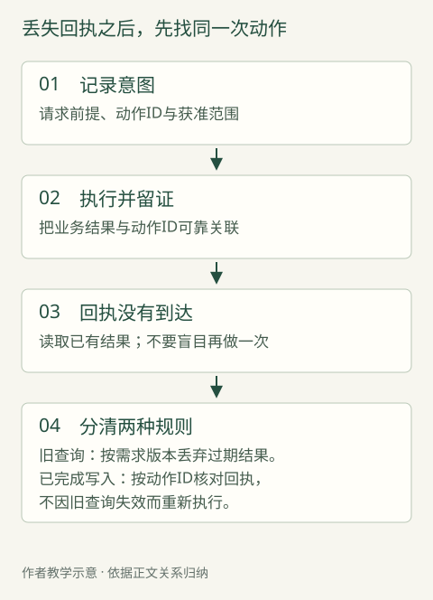

# 第七章　从能演示到能运行

德国零售商 OTTO 曾经有过一个能听、也能说的购物助手。顾客说话，系统先转成文字，交给文字助手处理，再把回答读出来。功能是通的，远程用户测试却暴露出另一件事：轮次之间的停顿，让人倾向于使用简短指令，而不是展开购物咨询。这是 Google Cloud 客户案例记录的一次原型迭代；文章也明确提到 Google 前线部署工程团队的支持。[^1]

这个片段很适合解释“能演示”和“能运行”的距离。演示证明了一条路径可以走通。一个人提出清楚的问题，系统完成处理，返回合适答案。但真实使用中的顾客会犹豫、改口、等待，也可能在答案说到一半时插入新条件。工程团队要安排的，是这些变化怎样穿过整套系统。

根据同一案例，2025 年 11 月，OTTO 转向原生音频方案，也就是让模型直接处理语音，不再把每轮交谈都串成“转文字—作答—再朗读”。语音模型处理实时交谈，文字助手并行负责检索、推荐及行为约束。团队还建设了协调层，也就是安排这些部分相互配合的软件。[^1] 顾客看见的是一句更流畅的回答，背后却多了一项责任：决定哪份结果已经可用，哪个动作仍在等待，哪些话此刻可以说。

OTTO 自己在 2026 年 3 月 5 日的公告中称，新购物助手当时正以测试版分批开放。[^2] 这里值得研究的是明确发生过的设计变化。它并不自动证明更高收入，也不能把体验变化全部归功于 FDE。我们先沿着请求走一遍，看看原型之后，工程工作究竟落在哪里。

## 一句话，要经过几次交接

以下用一个简化的购物助手说明机制。这是教学情境，不是 OTTO 内部系统的复原。假定顾客正在挑一台洗衣机，希望它安静，能放进已有空间，价格在预算内。助手能理解这句话，还远远没有完成任务。

首先，它要把可以查询的条件交给商品系统。工程师给模型提供一个“查找商品”的工具。这里的工具，就是一段已有或新写的软件：它接收规定格式的条件，访问企业系统，把结果送回来。模型决定何时提出查询，真正连接数据库、检查输入和执行查询的，是软件。

接着，商品系统返回候选。此时有两种很不一样的接口设计。一种只返回一大段商品说明，让模型自己从中寻找型号、尺寸和价格；另一种把这些项目分别列好，还保留商品编号和查询时间。前者省去了一些整理工作，后者则让下一步能够明确地指向“这一件商品”，并知道价格是何时查得的。这样的取舍发生在接口上，却直接影响回答能否落到真实商品。

随后，模型需要解释取舍。某个候选符合尺寸，却超出预算；另一个更便宜，但缺少可比较的噪声指标。合适的工程设计，应当允许结果保留“没有查到”的状态，而不强迫每个空格都出现漂亮答案。没有某项记录，与记录证明某项条件不满足，是两件不同的事。若软件把两者都压成一个空值，模型再善于表达，也无法仅凭这个结果分清两种情况。

假如顾客决定把某一台加入购物车，请求又跨过了一道边界。解释商品是一项读操作，改变购物车是一项写操作。前者取回资料，后者改变企业系统中的状态。工具应当告诉模型它做了什么：只是找到商品，已准备好待确认的项目，还是购物车确实完成了更新。聊天记录里的“好的”没有这种证明能力。

这样看，一次流畅的咨询包含多次交接：人的意图变成查询条件，查询条件变成系统调用，返回记录变成解释，确认的选择再变成业务动作。每次交接都可能丢失信息。FDE 可以参与的工程工作，是和客户团队一起决定这些边界怎样表达，并把边界写进可执行的软件，而不只在提示词里提醒模型“务必准确”。

这也改变了排查问题的起点。如果助手推荐了放不进空间的机器，团队应先问：尺寸条件是否进入了请求？工具是否支持这个条件？返回资料使用了什么单位？最后才检查模型是否忽略了已知尺寸。同一句错误推荐，可能对应完全不同的修复位置。统一换一个更大的模型，无法告诉团队原来的断点在哪里。

## 把容易犯的错，从接口上拿掉

Cohere 在 2026 年 8 月 27 日的一篇文章中，记录过一个匿名客户的会议简报 Agent：指令引用了不存在的工具，部分工具也不能处理任务需要的资料量。其 FDE 重建了 Agent，并修改了工具。[^3] 这是一个有限但具体的故障片段：任务说明承诺了一种工作方式，真实可调用的软件却没有完整提供它。

这类问题很容易被误读为模型“没有听懂”。然而，工具根本不存在时，理解得更准确也不会产生可执行的动作。工具只返回一小部分资料时，模型可能在自己的视野中认真完成了任务，交付仍然不完整。团队需要对照的是三样东西：任务要求、模型看见的工具说明，以及工具实际执行的行为。

一个工具名看起来合理，并不代表它的边界清楚。在教学系统里，“处理商品”可以指搜索、比较、上架，也可以指删除；“查找可购买商品”就更具体。不过，名字只是入口。工程师还要规定它接受哪些条件，能返回多少条记录，查无结果与系统故障如何区分，下一步是否还需要继续翻页。顾客不会询问这些细节，却会承受它们模糊时的后果。

Anthropic 在《Building effective agents》中记载过一个更小的修复：编程 Agent 改变工作目录后，使用相对文件路径时会出错，团队便调整工具，要求使用绝对路径。[^4] 相对路径像“楼上的那个房间”，需要双方共享当前位置；绝对路径则提供完整地址。修复缩小了误解的空间。模型仍然负责选择文件，但无须同时猜测“这里”究竟在哪里。

这种改动给 FDE 一个很实用的方向：看看哪些判断可以提前变成明确输入。仍以洗衣机为例，后续工具应接收商品系统返回的稳定编号，而非模型重新拼写的商品名。同一款产品可能有颜色和容量变体，一个看似准确的名称仍可能对应多个对象。把编号沿链条传下去，减少了一次重新解释；把名称留在旁边，又能让工程师看懂记录。

工具的颗粒度也要选择。若查一件商品必须依次调用“取品牌”“取尺寸”“取价格”“取库存”，模型便要管理更多中间结果；若把所有能力塞进一个“完成购物”的工具，出错后又难以辨认是哪一步失败。可考虑把经常一起读取、含义相近的信息整合到一次查询里，把需要顾客确认的状态变更保留为清楚的独立动作。这里没有通用的工具数量，只有具体任务的边界。

Anthropic 在 2025 年 9 月 11 日发布的工具工程文章中，也建议按工作流设计工具，返回与任务相关的信息，而非机械地把现有接口全部暴露给 Agent。[^5] 对客户而言，这意味着“已经有接口”和“已经适合模型使用”之间，可能还需要一层整理。它要保留业务含义，也要为错误留下可辨认的出口。

整理同样有代价。专用接口写得越贴近今天的流程，未来流程变化时越需要维护；过度裁剪返回资料，还可能让模型失去重要背景。因此，工程师应能说明每个被省略的字段为什么暂时无用，也能让任务在必要时取得更详细的记录。接口是对工作方式的判断，不能只按调用次数少不少来评价。

## 没收到回音，不等于没有发生

工具存在、输入正确，也可能没有按时返回结果。对模型来说，这看起来只是一段等待；对连接真实业务的系统来说，等待背后有一个关键问题：刚才的动作究竟发生了没有？

延续教学情境。顾客确认加入一台洗衣机，购物车服务已经保存了变更，却在回传结果时发生网络故障。助手没有收到回音。若它把“没有收到成功消息”理解成“没有执行”，再次发送一份新的加入请求，顾客的购物车就可能出现两件。这里，第二次尝试并没有纠正第一次，反而把不确定变成了重复动作。

AWS 的工程文库讨论过这种问题：调用方为请求提供唯一编号，服务端据此识别重复请求，并把该编号的记录与实际变更作为一个不可分割的操作处理。[^6] 这一思路通常称为“幂等”。放在此处，可以理解为同一项意图被重复传送时，不额外制造一次业务结果。

在教学系统里，可以把这理解为给顾客此次确认发一张小票号。助手重试时带着同一个号码，后端能够返回这一动作的处理结果，而不是把每次传送都认作新的购买意图。这里真正负责防止重复的，是服务端的执行规则。给模型一句“不要重复添加”的提醒，无法补上网络中丢失的回执。

但编号本身不是魔法。若系统保存了购物车变更，却没有保存编号，下次仍然无法判断；如果先保存编号而变更没有成功，又可能错误地认为已经完成。因此，动作和记录必须互相对应。工程团队也不能让顾客改选另一款商品后，仍沿用代表上一项意图的编号。否则，防重复的措施会阻止一个合理的新动作。

这对不写代码的负责人同样重要。当团队说“失败后会自动重试”，值得追问的是：他们如何知道哪一种失败可以重试？查询商品超时，可以重新读取；修改购物车后回执丢失，需要核对原动作；输入本来就不合法，原样重试多次也不会变对。三种情况都叫“失败”，补救措施却不同。

一个可解释的系统，应当让不确定性保留到用户面前。它可以说明正在核实购物车状态，稍后再报告结果；也可以退回明确的页面，让人查看已保存的内容。最危险的设计，是让语言模型在缺少回执时自行挑选一句听起来完整的话。礼貌和信心都不能补出那条缺失的业务记录。

这种处理需要存储、查询和恢复逻辑，增加的工作在顺利演示时几乎看不见。它的价值出现在连接中断、服务繁忙或用户重复点击时。原型走向运行，往往就在这里改变了工程预算：团队开始为“第一遍没有完整结束”设计第二条可走的路。

## 快起来以后，谁在等谁

回到 OTTO 的那次改造。顺次完成识别、处理和朗读，逻辑上容易理解：上一段结束，下一段开始。把语音与文字处理并行，能够让交谈和后台工作有更多重叠，但也给团队增加了安排先后的任务。并行能够缩短某些等待，却不会自动消除依赖。

这种差别在 Google 的 Live API——连接实时语音或视频对话的开发接口——文档里也有直观体现。2026 年 9 月 25 日所读版本说明，默认函数调用要等待结果；部分支持异步调用的模型，可以让工具在后台运行，并安排结果何时进入对话。[^7] 这是等待策略的另一份说明，不是 OTTO 历史配置的记录。

在我们的教学系统里，助手查库存时可以继续询问安装空间。顾客会感觉对话仍在进行，后台查询却可能尚未完成。工程师必须保证，助手用来填补等待的内容不越过已有证据：可以讨论选择条件，不能提前宣布某个仓库有货。把一段等待藏在交谈里，与让等待的工作真正完成，是两项不同的改进。

更棘手的是，顾客可能在查询期间改口：原先可以接受较宽的机型，现在发现空间更窄。旧请求随后返回一份漂亮的候选列表，答案却已经过时。系统需要知道，这份结果对应旧条件；它可以把旧记录留作追踪依据，同时只让新条件下的结果进入推荐。谁最后返回，不能成为谁最有资格发言的规则。

因此，协调程序至少要记住当前有效的需求版本、尚在执行的动作，以及结果所对应的那一轮请求。这里的“状态”并不神秘，就是把这些进展写成软件可以检查的记录。若全部依赖模型重新阅读聊天记录来判断，每次续接都可能产生不同解释。让程序保存已经确定的状态，模型才不必反复猜测过去发生了什么。

安排先后解决的是结果是否有效；接下来还要决定，为这次请求花多少资源。假设一次咨询原本等待一个搜索结果，现在同时检索三组候选，再交给另一次模型调用综合，某些顾客也许更快得到有用答案，后台完成的工作量却可能增加。若用户中途离开，没有取消的任务仍会继续消耗资源。这是一个工程推演，不是任何公司的成本数据。

一次请求可以花多少时间、最多尝试多少次，也应进入程序的执行规则。在教学系统里，库存服务持续没有响应时，助手不该无限重查，直到终于拼出一句肯定答复。到达约定边界后，它可以保留已经找到的商品，明确说明暂时不能确认库存，让顾客决定稍后继续还是改用现有页面。这样的降级会牺牲部分便利，却把局部故障限制在相应功能内。预算不仅用于控制账单，也用于决定系统何时停止扩大一个尚未解决的问题。

模型选择于是需要跟着环节走。理解含糊的偏好、解释不同产品的取舍，可能需要更强的语言能力；核对编号、筛掉超预算记录，则可以由明确规则处理。把所有环节交给同一个最强模型，省去了分工设计，却也可能让简单工作承担过高的延迟和费用。反过来，层层安排模型互相检查，也会引入新的等待和不一致。

这种取舍不能在抽象的模型榜单上完成。工程师要观察具体链条：慢的是模型生成，还是库存服务排队？昂贵的是一次复杂判断，还是反复传入大段无关资料？若等待来自后端，换一个更快生成文字的模型未必改变顾客体验；若成本来自重复查询，压缩最后答案的字数也抓错了位置。

比较方案时还需要保存两种时间。第一种是从顾客提出要求，到得到有用回应的时间；第二种是任务真正结束的时间。助手可以很快说“我在查”，但这不等于推荐已经完成。把两者混在一起，团队可能在报表上持续提速，顾客却依然等不到能作决定的结果。

## 留下能够继续工作的现场

当任务涉及多次调用时，运行的要求又往前走了一步：中断之后，团队能否知道已经完成了什么，系统能否从适当的位置继续？

Anthropic 在 2025 年 6 月 13 日发布的多 Agent 研究系统文章里，描述了恢复已有任务、设置检查点和记录完整执行轨迹的工程工作。团队需要区分搜索词不合适、选错来源和工具故障，而只看最终答案，难以定位这些问题。[^8] 这不是一个 FDE 客户案例，却说明了同类系统运行时会遇到的具体困难。

把前面的教学购物请求收拢到一份记录里，就能看见这些机制是否互相配合。顾客先说机器宽度不得超过60厘米，随后改成55厘米；购物车最初为空。下表的时间只是排列先后，不是任何产品的性能测量。Q表示查询号，A表示一次已经得到顾客确认的加入意图，R表示服务端回执。

| 次序 | 系统实际收到或完成的事 | 留下的依据与下一动作 |
| --- | --- | --- |
| 1 | 按60厘米条件发出Q1 | 需求版本v1，查询尚未结束 |
| 2 | 顾客改成55厘米，发出Q2 | 当前版本升为v2；Q1即使回来也不能直接推荐 |
| 3 | Q2返回宽54厘米的SKU-54；顾客确认加一台 | 以A1发送商品编号、数量1与v2，固定本次请求内容 |
| 4 | 服务端写入购物车，同时保存A1对应的R1；回传途中断线 | 购物车版本12、数量1；助手端暂记“结果待核实” |
| 5 | 助手以同一A1及相同内容重试 | 服务端返回已有R1，数量仍为1，不再加一台 |
| 6 | Q1迟到，返回宽59厘米的SKU-59 | 记录属于v1，丢弃其推荐资格，不改变购物车 |
| 7 | 对话进程重启，从保存的记录恢复 | 按A1核对R1，再读取购物车版本12和数量1；没有新增写入 |
| 8 | 助手报告已加入SKU-54一台 | 结论同时对应顾客确认、服务端回执和恢复后的状态 |

这里有两种不能混用的编号：需求版本判断一份查询是否过时，动作编号识别一次写入是否重复。若把“重新发送”一律当新动作，第5步会变成两台；若只按返回先后接受结果，第6步会推荐放不进去的机型；若恢复只读聊天记录，第7步仍然无法确认购物车里是什么。

*图：丢失回执之后，先找同一次动作。教学轨迹的关系图。需求版本判断查询是否过时，动作ID判断写入是否重复，两种规则分开；完整8步见C07配套CSV/JSON。*

[运行记录与故障练习](../appendix/toolkit/engineering/C07-runtime/README.md)提供这8步的CSV、请求与回执JSON，以及空白记录。读者可先遮住“下一动作”，判断各步该查询、重试、丢弃还是停下，再核对示范答案。这套小样本不实现完整购物系统；库存新鲜度、身份权限和支付都在练习范围之外。若把它用于真实交付，必须另外设计这些部分，不能把“购物车不重复”误当作“订单安全”。

保存的记录也不是越多越好。本例只需要条件版本、商品编号、请求内容的摘要、动作号、回执号和业务状态；排障人员无须因此获得顾客其他会话。已完成的购物车变更可以据回执核对，价格与库存是否仍有效则要另行读取。恢复的是业务进度，不是把中断前的话继续念完。

这些记录还为改进留下比较对象。一次修改可能缩短了返回资料，却丢掉判定条件；一次工具整合可能减少调用次数，却让错误原因变得含糊。团队应当能够指出修改了哪条交接规则，预期消除哪类故障，新增了什么代价。至于如何系统检验这些预期、达到什么标准才允许扩大使用，属于下一章的评估与发布问题。

对 FDE 来说，持续靠人盯住每次运行并不是这段工作的终点。工程价值在于把亲自排查时得到的认识，落到明确的接口、状态和恢复路径上。这样下一次类似故障发生时，软件能够给出足够的信息，让处理者不必重新猜测整段过程。

据此，本书建议负责人和工程团队把首期范围写得具体一些。在教学系统里，如果只承诺查询和比较，就先约定可用条件、错误状态以及供排查的记录；允许修改购物车时，再明确谁负责确认意图、识别重复请求和核对业务回执。少承诺一个动作，可以少承担一组运行责任；决定增加动作时，也就知道必须补上什么。

## 复杂度需要一个理由

OTTO 的材料保留了模型能力、内部工程与前线部署团队共同参与的边界。它最有解释力的地方，是用户测试里的停顿改变了系统安排：团队需要把新的模型能力接成新的工作方式，而非只替换一个名称。

保留下来的判断更具体：在模型能力改变之后，团队仍然需要重新安排模型与工具之间的工作。能力带来新的可能，也把新问题带到接口上。能同时处理更多信息，就要防止不同轮次混在一起；能执行更多动作，就要留下可靠回执；能运行更久，就要安排恢复和停止。

这不意味着每个项目都需要复杂的自主 Agent。Anthropic 在《Building effective agents》中建议从最简单的可行方案开始，并区分固定工作流与由模型动态选择步骤的 Agent。[^4] 假如任务只是按订单编号查状态，预设步骤配上适当的语言解释，可能已经足够。允许模型自由探索的收益，要大于它带来的协调、费用和维护负担。

负责人也不必据此把工程团队的每个接口都审一遍。只要跟随一个真实请求，就能提出有分量的问题：答案里的事实从哪里来？写入动作由什么回执确认？没有回音时，系统会做什么？顾客改口之后，旧结果如何退出？这些问题能让一段漂亮演示暴露出它尚未承担的责任。

从能演示到能运行，系统逐步获得的是处理不确定性的能力。语言仍然可以灵活，业务动作则有可核对的边界；局部故障仍然可能发生，团队却知道哪里能够重试，哪里必须停下来查明。FDE 参与这段工作的价值，需要落在这些实际改变上。接下来才有条件认真讨论：这样的系统，究竟已经好到可以交给多少人使用。

---

[^1]: Google Cloud，[OTTO: A product marketplace that listens](https://cloud.google.com/customers/otto-voice-shopping-ai)，无可见发布日期，2026-09-25 访问，重点读取“Building a voice that knows the aisles”。供应商案例含客户人员引语；本章不采用其延迟及经营效果数字。协调层的内部协议和代码未公开。

[^2]: OTTO，[Smart Shopping: OTTO startet neue KI-Assistenten](https://www.otto.de/unternehmen/de/presse/smart-shopping-otto-startet-neue-ki-assistenten)，2026-03-05 发布，2026-09-25 访问。客户公告称 beta 正在逐步推出；Google 案例另记语音购物在 2026 年 5 月初 open beta，两篇材料没有解释版本与开放人群的关系，本章不据此推定统一上线日。

[^3]: Nastya Kats / Cohere，[Why forward-deployed engineers should build capability, not dependency](https://cohere.com/blog/forward-deployed-engineers-capability-building)，2026-08-27 发布，2026-09-25 访问，“What FDEs offer”一节。客户及项目日期未披露，本文不为该片段补写现场或效果数字。

[^4]: Anthropic，[Building effective agents](https://www.anthropic.com/engineering/building-effective-agents)，页面标注 2024-12-19 发布，2026-09-25 访问；参见“When (and when not) to use agents”及“Appendix 2: Prompt engineering your tools”。页面存在后续更新提示，文件路径改动的实际发生日期不明，不把现读版本的产品信息当作 2024 年历史配置。

[^5]: Anthropic，[Writing effective tools for agents — with agents](https://www.anthropic.com/engineering/writing-tools-for-agents)，2025-09-11 发布，2026-09-25 访问，“Choosing the right tools for agents”及“Returning meaningful context from your tools”。正文采用工程建议，不采用供应商自述评估收益。

[^6]: Malcolm Featonby / AWS，[Making retries safe with idempotent APIs](https://aws.amazon.com/builders-library/making-retries-safe-with-idempotent-APIs/)，无可见发布日期，2026-09-25 访问，“Reducing client complexity”及“Same client request ID, different intent”。购物车请求为本书教学情境，不是该文或 OTTO 披露的项目实现。

[^7]: Google，[Live API: Tool use](https://ai.google.dev/gemini-api/docs/live-api/tools)，2026-09-25 读取的动态技术文档，“Async function calling”一节。功能支持范围依模型变化；本章只用它解释同步等待与异步调度的区别，不据此还原 OTTO 在 2025 年的接口设置。

[^8]: Anthropic，[How we built our multi-agent research system](https://www.anthropic.com/engineering/multi-agent-research-system)，2025-06-13 发布，2026-09-25 访问，生产工程挑战部分。一般 Agent 工程对照，不作为明确 FDE 项目登记。
